<!-- Supporto Mermaid -->
<script src="https://cdn.jsdelivr.net/npm/mermaid/dist/mermaid.min.js"></script>
<script>mermaid.initialize({startOnLoad:true});</script>

# Sistema di autenticazione basato su Zero Knowledge Proof

Un prototipo didattico che implementa un sistema di autenticazione basato su **Zero Knowledge Proof** (ZKP), con due varianti:
- **Protocollo interattivo** (Sfida/Risposta classica)
- **Trasformazione non interattiva** (Fiat-Shamir heuristic)

Realizzato per l'esame di Sicurezza dell'Informazione M - Università di Bologna.

--------------

## 📚 Concetti Chiave

### Zero Knowledge Proof
Protocollo crittografico che permette di dimostrare la conoscenza di un segreto **senza rivelarlo**, verificando:
1. **Completezza**: Se il segreto è vero, il Verifier è convinto
2. **Solidità**: Se il segreto è falso, il Verifier rifiuta con alta probabilità
3. **Zero-knowledge**: Il Verifier impara solo la veridicità della dimostrazione

### Trasformazione Non Interattiva
La **euristica di Fiat-Shamir** converte protocolli ZKP interattivi in non interattivi:

```math
e = \mathcal{H}(x) \mod 2
```
dove `H` è una funzione hash crittograficamente sicura (es. SHA-256). 

Tra i suoi vantaggi principali, elimina la comunicazione singola e risulta più efficiente in contesti asincroni (es. blockchain)

### Protocollo Implementato
Variante del protocollo di Feige-Fiat-Shamir semplificato:

1. **Registrazione**:
   - Il client genera `s` (segreto derivato dalla password)
   - Calcola `v = s² mod n` (verifier value, con n numero primo)
   - Invia `v` al server (valore pubblico)

2. **Autenticazione** (per ogni round):

- Modalità interattiva

```mermaid
    sequenceDiagram
    participant P as Prover
    participant V as Verifier
    P->>V: x = r² mod n
    V->>P: e ∈ {0,1} (sfida)
    P->>V: y = r·sᵉ mod n
    V->>V: Verifica y² ≡ x·vᵉ mod n
```

- Fiat-Shamir (non interattiva)
    Il prover genera autonomamente `e = hash(x) % 2` (sfida derivata) ed elimina l'interazione, mantenendo la sicurezza

--------------

## 📚 Osservazioni

| Caratteristica         | Protocollo Interattivo                          | Fiat-Shamir (Non Interattivo)               | Spiegazione                                                                 |
|------------------------|-----------------------------------------------|--------------------------------------------|---------------------------------------------------------------------------------------|
| **Comunicazione**      | Multi-round (3 passaggi/round)                | Singolo messaggio                          | Elimina la necessità di scambi multipli tramite l'uso di hash crittografici           |
| **Generazione Sfida**  | Verifier genera `e ∈ {0,1}`                   | `e = hash(x) % 2`                          | La sfida deriva deterministicamente dall'impegno `x`                                  |
| **Sicurezza**          | Sicuro contro attacchi attivi e passivi       | Sicuro principalmente contro attacchi passivi | La natura deterministica della sfida la rende vulnerabile ad attacchi attivi          |
| **Complessità**        | O(k) messaggi (k = numero round)              | O(1) messaggi                              | Riduzione quadratica della complessità di comunicazione                               |
| **Overhead Computazionale** | Alto (richiede sincronizzazione)          | Basso (elaborazione offline)               | Il Verifier non deve essere online durante la generazione della proof                 |
| **Use Case Ideali**    | Autenticazione in tempo reale                 | Blockchain, firme digitali                 | Trade-off tra sicurezza e performance                                                 |
| **Prob. Falso Positivo** | `(1/2)^k` per k round                      | `(1/2)^k` (stessa ma senza interazione)    | La sicurezza teorica rimane invariata                                                 |
| **Dipendenza Temporale** | Richiede sincronizzazione stretta           | Nessuna                                    | Le proof possono essere generate e verificate in momenti diversi                      |
| **Implementazione**    | Più complessa (gestione stato)               | Più semplice                               | Rimuove la necessità di mantenere stato tra i round                                   |
| **Esempio Reale**      | Autenticazione bancaria                       | ZK-SNARKs in Ethereum                      | Differenze nell'adattamento a scenari reali                                           |

### Legenda Concetti Chiave:
- **`e`**: Sfida binaria (0 o 1)
- **`x`**: Impegno (commitment) del Prover
- **`y`**: Risposta del Prover
- **`k`**: Numero di round di verifica
- **O(k)**: Complessità lineare nel numero di round


--------------

## 🛠️ Struttura del progetto

```
progettosicurezza/
│
├── server.js         # Server Express principale
├── zkp.js            # Funzioni ZKP modulari
├── userDb.js         # Gestione utenti in memoria
├── users.json        # Database locale degli utenti
├── public/           # Cartella per frontend statico
│   └── index.html    # UI di registrazione/login
├── package.json
└── README.md
```

### Tecnologie utilizzate

- Backend: Node.js con Express.js
- Frontend: HTML, CSS, JavaScript vanilla
- Comunicazione frontend-backend tramite fetch API (JSON)

--------------

## 🔧 Installazione

1. Clonare il repository
2. Installare le dipendenze:
    ```bash
        npm install express body-parser crypto
    ```
3. Avviare il server:
```bash
    node server.js
```
4. Navigare nel browser: http://localhost:3000

--------------

## 📖 Risorse
- [Fiat-Shamir heuristic](https://en.wikipedia.org/wiki/Fiat%E2%80%93Shamir_heuristic)
- [Proof of knowledge](https://en.wikipedia.org/wiki/Proof_of_knowledge#Sigma_protocols)
- [Zero-knowledge proof](https://en.wikipedia.org/wiki/Zero-knowledge_proof)
- [Non-interactive zero-knowledge proof](https://en.wikipedia.org/wiki/Non-interactive_zero-knowledge_proof)


